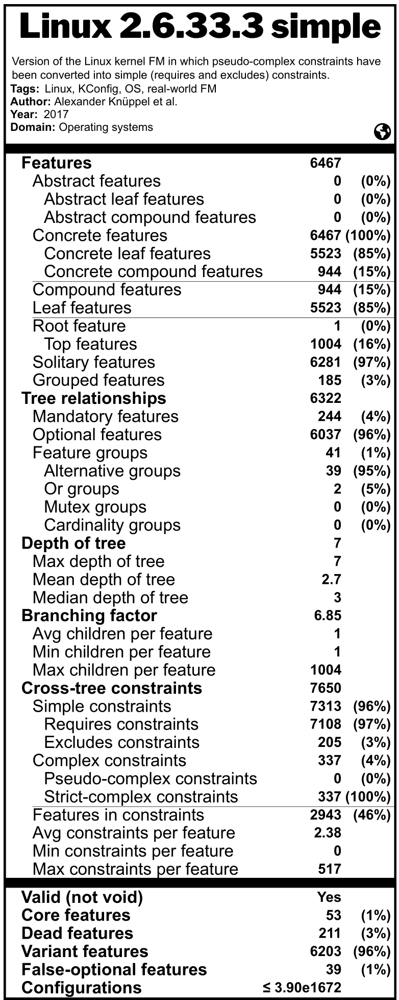

*FM Fact Label* is an online web-based application that builds an FM characterization and generates its visualization as a fact label.

 

## Features

- Clear and elegant design to visualize the metrics of your feature models
- Inspired by the nutrition fact label used in the food industry
- Up to 76 different measures reported
- Metadata, structural (syntactical) metrics, and analysis (semantical) results
- Powered by [flamapy](https://www.flamapy.org/) for the automated analysis of feature models
- Part of the [UVL](https://universal-variability-language.github.io/) ecosystem
- Support all language extensions of [UVL](https://universal-variability-language.github.io/)
- Easy to use standalone web-based online application
- Configure and customize the fact label visualization
- Export the fact label to SVG, PNG, or PDF
- Export the characterization to JSON or TXT
- Load a previous computed characterization in JSON

## Publications

- José Miguel Horcas, José A. Galindo, Lidia Fuentes, David Benavides. *FM Fact Label*. Science of Computer Programming (SCP). 2025. DOI: <a href="https://doi.org/10.1016/j.scico.2024.103214">https://doi.org/10.1016/j.scico.2024.103214</a>
<button type="button" onclick="copyBibTeX(bibtexEntry1)">Copy BibTex 🗎</button>

- José Miguel Horcas, José A. Galindo, Mónica Pinto, Lidia Fuentes, David Benavides. *FM Fact Label: A Configurable and Interactive Visualization of Feature Model Characterizations*. 26th International Systems and Software Product Line Conference (SPLC). Demo and Tools Track. 2022. DOI: <a href="https://doi.org/10.1145/3503229.3547025">https://doi.org/10.1145/3503229.3547025</a>
<button type="button" onclick="copyBibTeX(bibtexEntry2)">Copy BibTex 🗎</button>

## Example

A fact label of the Linux feature model

## Entities involved

